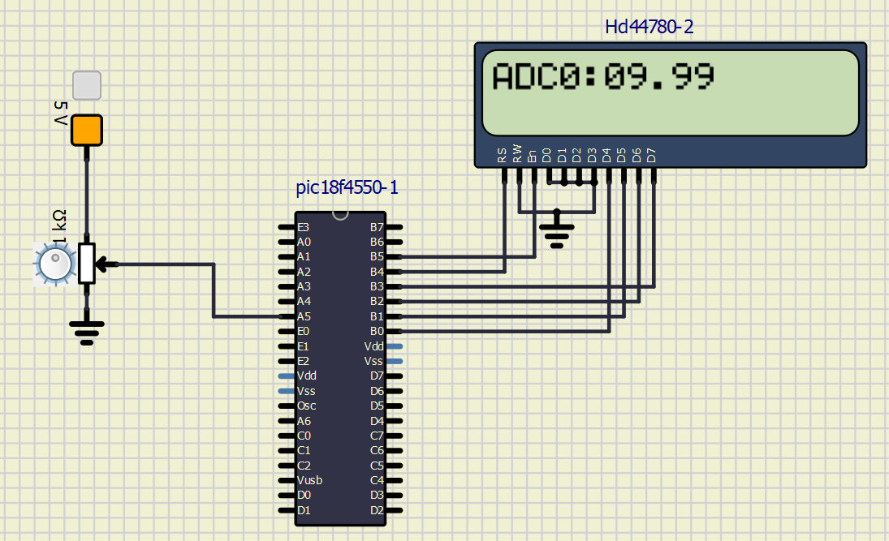

# Leituras Analogicas em Sistemas Embarcados
Projeto 3 da disciplina SEL0614 - Aplicação de Microprocessadores (2023.2)

# Alunos:
- Fernando Clarindo Cristóvão- 12547573 - fercristovao@usp.br
- Fernando Lucas Vieira Souza - 12703069 - felucas.souza@usp.br
- Gustavo Moura Scarenci de Carvalho Ferreira - 12547792 - gustavomourascarenci@usp.br
- Matheus Henrique Dias Cirillo - 12547750 - matheuscirillo@usp.br

# Explicação do projeto
O projeto simula a integração de leituras analógicas com a exibição de dados em um display LCD, utilizando um microcontrolador PIC18F4550. O foco principal está no uso de um conversor A/D (Analógico para Digital) para ler variações de tensão e no uso das bibliotecas para exibir estes valores no display LCD.

Primeiramente, o conversor A/D é utilizado para transformar sinais analógicos em sinais digitais. O canal analógico RA5 é configurado para leitura, permitindo que o microcontrolador receba e processe dados analógicos variáveis. O processo de aquisição de um A/D envolve três etapas principais: amostragem, onde o sinal analógico é medido em intervalos de tempo regulares; quantização, que aproxima esses valores amostrados para um conjunto finito de valores digitais, com a precisão determinada pela resolução do conversor (por exemplo, um conversor de 10 bits tem 1024 valores discretos); e codificação, que converte os valores quantizados em um código binário.

O próximo passo é a configuração dos registradores do microcontrolador. No código, ADCON1 = 0B00000000 é usado para definir todos os canais do PIC18F4550 como entradas A/D. Além disso, a direção do fluxo de dados para os pinos ligados ao display LCD é estabelecida, garantindo que os dados possam ser enviados corretamente para o display.

O código emprega bibliotecas e funções específicas para simplificar a interação com o hardware. A função ADC_Init() inicia o módulo ADC, enquanto Lcd_Init() prepara o display LCD para uso. Estas bibliotecas reduzem a complexidade do código e aumentam a legibilidade, tornando mais fácil a programação de microcontroladores.

A exibição dos valores de tensão no display LCD é feita por meio da biblioteca, mas antes o valor lido pelo ADC é convertido e formatado para um formato numérico com duas casas decimais, adequado para visualização. A função Lcd_Out() é então usada para mostrar estes valores no display, fornecendo um feedback visual imediato das leituras do ADC.

Por fim, o programa entra em um loop infinito, onde continua a ler valores do ADC e atualizar o display LCD. Este loop permite que o sistema responda dinamicamente às variações do sinal analógico, tornando-o adequado para aplicações que exigem monitoramento contínuo e exibição de dados em tempo real.

